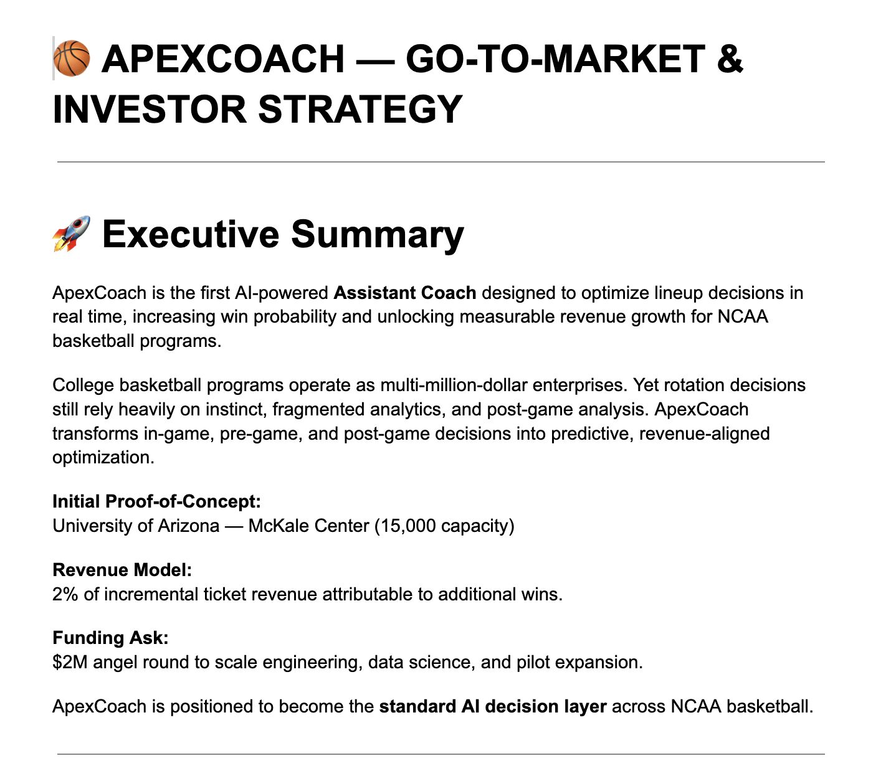
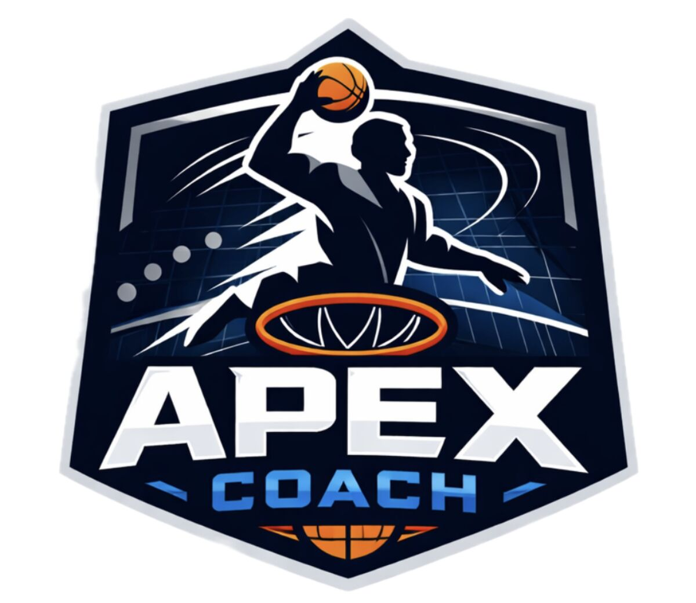
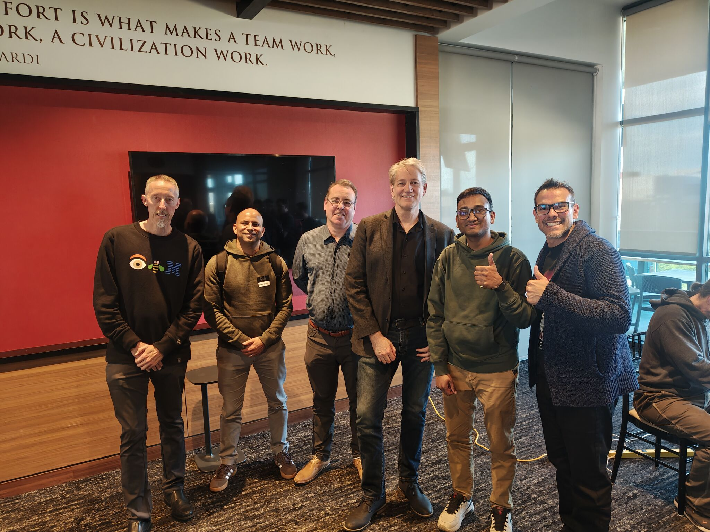
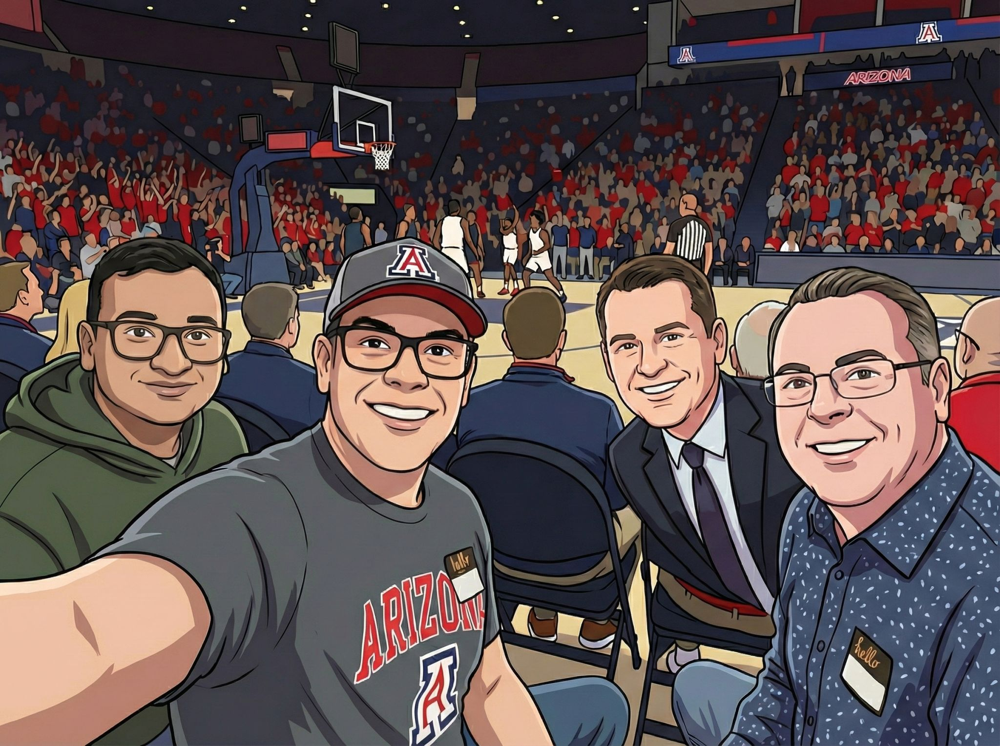

# ApexCoach

**AI-Powered Assistant Coach for NCAA Basketball**
**2nd Place — AI Trailblazers Hack-AI-Thon**

> "Every additional win is worth millions. What if we could increase win probability in real time?"

ApexCoach is a multi-agent AI system that helps college basketball coaches make smarter lineup decisions — optimizing player matchups in real time to maximize win probability.

Built at the AI Trailblazers Hack-AI-Thon by Marco Hidalgo, Sean D'Addamio, and Saikumar Bollam using only our expertise and AI tools, the proof-of-concept focuses on **BYU Cougars vs. Arizona Wildcats** matchups, demonstrating how AI can transform in-game coaching decisions into measurable competitive and revenue advantages.

---

## The Team

| Name | Role |
|---|---|
| Marco Hidalgo | Project Lead |
| Sean D'Addamio | Creativity, Design & Marketing |
| Saikumar Bollam | Software Development |

---

## Hackathon Recognition

We placed **2nd out of all teams** at the AI Trailblazers Hack-AI-Thon, receiving recognition from judges, organizers, and sponsors for both the technical implementation and the quality of our presentation.

> "You guys truly rock the presentation, it turned out great!" — AI Trailblazers

> "The distance between 'we should build this' and 'it exists' is collapsing." — Mick Pennington, MBA

**LinkedIn Post:** [View our 2nd place announcement](https://www.linkedin.com/posts/mhidalg_beardown-gocats-beatbyu-ugcPost-7430053341595967488-Rro1) — 50+ likes, active engagement from the sports AI and startup community.

---

## Team Photos

<table>
  <tr>
    <td></td>
    <td></td>
  </tr>
  <tr>
    <td></td>
    <td></td>
  </tr>
</table>

---

## What It Does

Users select up to 5 players from the BYU Cougars roster. ApexCoach's multi-agent system analyzes the selected lineup and recommends the optimal 5-player counter-lineup from the Arizona Wildcats — along with per-player matchup explanations and stats.

### Agent Roles

| Agent | Role |
|---|---|
| Developer Agent | Professional software developer |
| Analytics Agent | Sports analyst focused on college basketball |
| Data Science Agent | PhD statistician, software developer, sports gambler |
| Marketing Agent | Master marketer |
| Basketball Coach Agent | Vets lineup combinations to maximize win probability |

### Matchup Engine

The `find_best_lineup()` function uses a greedy assignment algorithm — scoring each Arizona player against each BYU player via `matchup_score()` weighted across:

- Position compatibility
- Size
- Scoring
- Defense
- Rebounding
- Minutes played

---

## Market Opportunity

College basketball programs are multi-million-dollar enterprises. The University of Arizona's McKale Center alone has a theoretical revenue ceiling of **$81M per season**. ApexCoach's conservative model projects that contributing to just +2 additional wins and a +5% attendance lift produces **$5.6M in incremental revenue** — of which ApexCoach captures 2% ($112,000/year from a single program).

With 350+ NCAA Division I programs, the total addressable market exceeds **$26M annually** — and doubles with women's basketball expansion.

See [MARKETING.md](MARKETING.md) for the full go-to-market strategy, financial model, and investor narrative.

---

## Getting Started

### Requirements

- Python 3.9+
- Streamlit

### Setup

```bash
# Clone the repo
git clone https://github.com/your-username/aitrailblazershackathon.git
cd aitrailblazershackathon

# Create and activate virtual environment
python3 -m venv apenv
source apenv/bin/activate

# Install dependencies
pip install -r requirements.txt

# Run the app
streamlit run app.py
```

---

## Data Sources

Player data is sourced from ESPN's men's college basketball endpoints for the 2025–26 season:

- **BYU Cougars** — Roster, stats, and team info (`/team/roster/_/id/252`)
- **Arizona Wildcats** — Roster, stats, and team info (`/team/roster/_/id/12`)

Stats included: PPG, RPG, APG, STL, BLK, FG%, 3P%, FT%

---

## Vision

ApexCoach is not analytics software. It is the inevitable evolution of coaching in a multi-million-dollar competitive environment. Programs that adopt early gain a competitive edge, revenue growth, recruiting leverage, and a data moat advantage.

**Within 5 years, AI-driven lineup optimization will be standard across NCAA basketball.**

---

## Built With

- [Streamlit](https://streamlit.io/) — UI framework
- Python 3.9
- AI tools (Claude, ChatGPT) — used throughout development at the hackathon
- ESPN public data

---

*Built at the AI Trailblazers Hack-AI-Thon · 2nd Place · #BearDown #GoCats*
